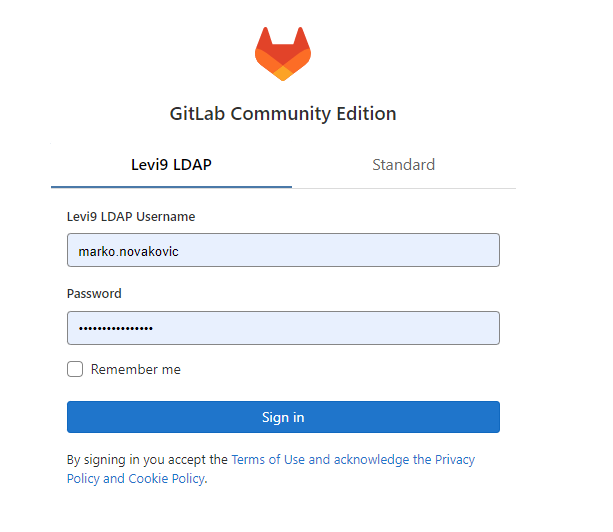

## Pre-Requisites for running react locally
   Before you get started, there are some prior conditions or prerequisites required by your system. Make sure that your system:
   #### Installing NPM and Node.js:

   * Go to this link https://nodejs.org/en/
   * Download the current latest features version - not the LTS version 
   * While installing Node.js, install NPM with it too

   #### install VSCode  Text Editor: 

   * https://code.visualstudio.com/

## How to start project:

* clone this repo: https://github.com/mnovakoviclevi9/challenge2-boilerplate

   ```sh
     git clone https://github.com/mnovakoviclevi9/challenge2-boilerplate
   ```

* into the root of project install npm packages: 
   ```sh
      npm install
   ```

* Run application localy: 
   ```sh
      npm run start
   ```

## Api documentation:
  * https://fakestoreapi.com/docs

   For this challenge we will use the fallowing routes:
   1) All Products: https://fakestoreapi.com/products
   2) Single Product: https://fakestoreapi.com/products/1
   3) Categories:  https://fakestoreapi.com/products/categories

   Bonus:
   1) Login: https://fakestoreapi.com/auth/login
   2) Account Page: https://fakestoreapi.com/users/[user_id]

## requirement
- use some of  UI component libraries
- use state managment react context or redux 
- use some of the libraries for workin with forms ( React-hook-Form or Formic)
# Create Pages:
1) Home page : there will be displayed list of products
   * Product cards: each card should have image, price title, and category, add wishlist
     all cards will be clicable and after click on particular card we will be redirected
     on single product
   - create filters: by category, price rang
   - sorter: by price, by title asc & desc
   - autocomplete searh product by title

2) Single Product page: Detail of product
   This page should contain the folowing components :
    - title
    - description
    - Image
    - price
    - button add to wishlist
    - button add to cart ( with posibility to add quantity)
    - Category 
    - rating,
   * each section should be component which will be included
4) Cart page:
   table with chosen products:
    -  Title, price, quantity and subtotal, remove button
    - Checkout button which will redirect on checkout page
5) Checkout page:
    with checkout form and order review

***Bonus challenge***

1) Wishlist Modal;
   * hint:
     save wishlist items into localStorage
2) Login Page:
   login form with email & password fields
   * Hint!
     After successful authentication, we need to save jwt token in local storage
3) User Profile Page
  Restrict access of user profile page to logged user only
 * Hint!

   in orter to show user's detail info we need to make additional request on the following api route with id of logged user:
   https://fakestoreapi.com/users/[user_id]

   The info of  User's id we can find in decoded JWT token as "sub" property and it looks like:
   ```json
   {
   "sub": 2,
   "user": "mor_2314",
   "iat": 1668417671
   }
   ```

   * How to implement private routes:
     https://www.robinwieruch.de/react-router-private-routes/
4) Add Multilanguage Support :
 * https://react.i18next.com/guides/quick-start
 * https://locize.com/blog/react-i18next/
      
# USEFUL RESOURCES:
   
   ### ES7+ React/Redux/React-Native snippets - VS Code Extension
    * https://marketplace.visualstudio.com/items?itemName=dsznajder.es7-react-js-snippets
    * https://www.youtube.com/watch?v=1tBHgCHyi8A
   ### React DevTool - Chrome Extension:
   *  https://chrome.google.com/webstore/detail/react-developer-tools/fmkadmapgofadopljbjfkapdkoienihi
   * How to use it: https://www.youtube.com/watch?v=rb1GWqCJid4&ab_channel=TheNetNinja

   ###  REST API DATA
      * AXIOS HTTP Client for  - https://axios-http.com/docs/intro
      * react-query: Hooks for fetching, caching and updating asynchronous data -   https://www.npmjs.com/package/react-query

 ### UI Libraries
1) MATERIAL-UI https://mui.com/material-ui/getting-started/overview/
2) ANT DESIGN : https://ant.design/docs/react/introduce
3) REACT-BOOTSTRAP: https://react-bootstrap.github.io/getting-started/introduction
4) SEMANTIC UI : https://react.semantic-ui.com

### FORM VALIDATION:
* React-hook-Form & YUP: https://react-hook-form.com/
* FORMIK & YUP: https://formik.org , https://www.npmjs.com/package/yup


### REACT TYPESCRIPT:
 * typescript cheatsheet: https://react-typescript-cheatsheet.netlify.app/docs/basic/setup

 ### IT'S GOOD TO READ BEFORE YOU START:
1) https://blog.webdevsimplified.com/2022-07/react-folder-structure/
2) https://andela.com/insights/structuring-your-react-application-atomic-design-principles/
3) https://reactgo.com/react-custom-hooks

  # BASIC PROJECT STURCTURE

```bash
|-src
|  |
|  |--assets
|     |---images  
|     |---fonts
|  |--components
|     |--Button # EXAMPLE
|          |--index.ts
|          |--Button.tsx
|          |--styles.module.css
|     |--CartBadge # EXAMPLE
|          |--index.ts
|          |--CartBadge.tsx
|          |--styles.module.css
|  |--context
|     |--cart  # EXAMPLE
|        |--CartContext.tsx
|        |--CartProvider.tsx
|        |--CartReducer.tsx

|  |--hooks
|     |--useCartHook.tsx
|     |--useProductsHook.ts
|  |--interfaces
|     |-index.ts
|  |--pages
|     |--home # EXAMPLE
|        |--Home.tsx
|        |--index.ts
|     |--about-us # EXAMPLE
|        |--AboutUs.tsx
|        |--index.ts
|     |--404
|        |--404.tsx
|        |--index.ts
|  |--services
|        |--base-http.service.ts
|        |--products.service.ts
|        |-...
|  |--utils
|        |--index.ts
|        |--classNames.ts
|        |--jwtDecoder.ts
|  |-- App.tsx
|  |-- index.tsx
|  |--.env
|  |--.env.production
|  |--.env.test
|  |--.gitignore
|  |--package.json
|  |--tsconfig.json
```

idea for mockup design
https://ninetheme.com/themes/styler/fashion/shop/?min_price=10&max_price=190&shop_layouts=left-sidebar

https://coruscating-zuccutto-2cd80d.netlify.app/cart

# Gitlab repo:
* https://vcs.levi9.com/

* Click on ***Levi9 LDAP*** tab and login with your azure credentials<br/>
  

* Create new repository 

* Add members: marko.novakovic@levi9.com, d.timotic@levi9.com with developer role.


